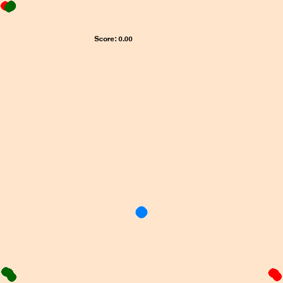

# Bouncing Balls

Simple 2D game created as a research challenge for Reinforcement Learning algorithms

## Game Overview

Rules are pretty simple: Moving the hero ball around the 2D plane, hit all the Green Balls while avoiding the Red ones. The balls' initial coordinates and velocity vector are randomly generated at the start of each game. The balls bounce on each of the 4 sides of the environment.

The game terminates if:
* All Green balls have been hit
* One of the Red balls has been hit
* 1000 time steps have elapsed

## Modeling and Training

Despite its simplicity, the game's environment has a highly dimensional observation space and a pretty sparse reward structure. Solving it efficiently required training a [Proximal Policy Optimisation](https://en.wikipedia.org/wiki/Proximal_policy_optimization) model preliminary calibratred using [Behavioural Cloning](https://en.wikipedia.org/wiki/Imitation_learning) of a heuristic based expert agent.

## Dependencies

The PPO model comes from the excellent [StableBaselines3](https://github.com/DLR-RM/stable-baselines3) Python library and as it is required in that case, the game environment implements the [Gymnasium](https://github.com/Farama-Foundation/Gymnasium) API standard.

During main training loop, Tensorboard logs are created and saved in the `logs` folder.

## Scripts

The whole training process can be reconstructed on your machine:

1. Run `bc_training.py` to record the simulations of the expert agent actions on 128 game simulations and, run the **Behavioural Cloning** algorithm using a balanced loss function.
2. Run `train.py` to finalise the training of the PPO model on multiple online simulations and save versions of the trained model.
3. Run `compare_performance.py` to compare your RL model and the expert agent. If the RL model does not outperform the agent, go back to step 2.
3. Run `simulate.py` to see your trained agent in action.